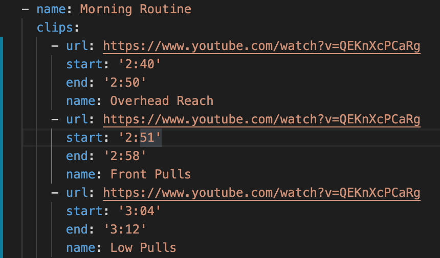
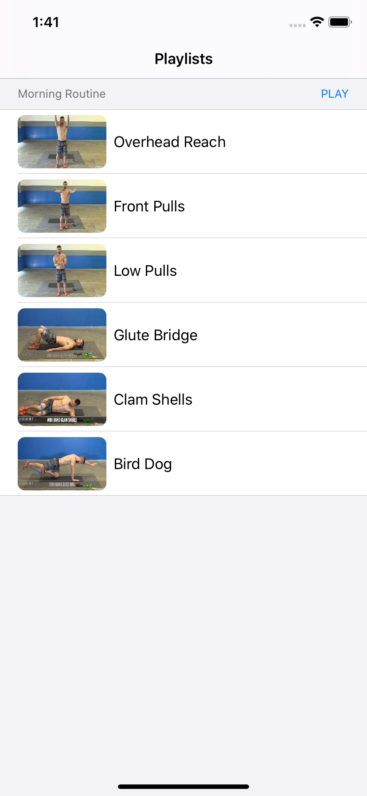
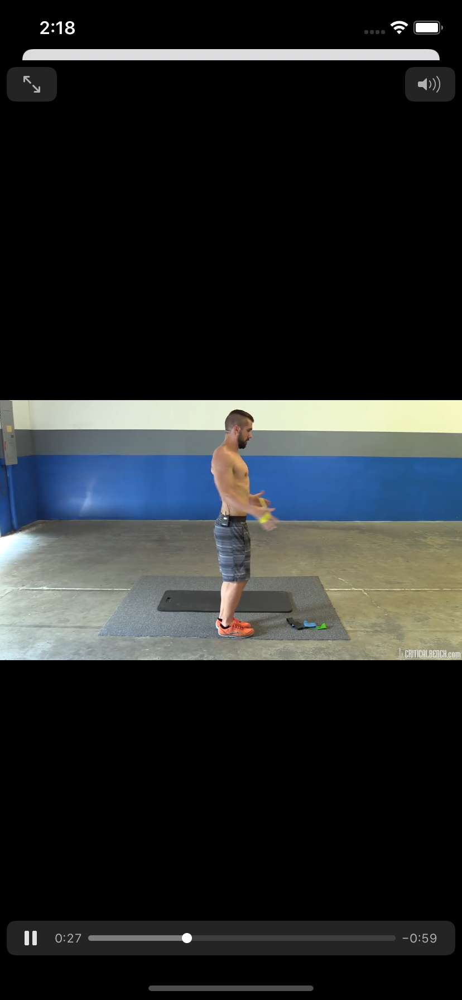

# ChunksUnited

ChunksUnited is an iOS SwiftUI app for creating playlists from Youtube video chunks

[![Swift Version][swift-image]][swift-url]
[![License][license-image]][license-url]
[](http://makeapullrequest.com)

## Requirements

- iOS 13
- Swift 5
- Xcode 11

## Installation

Use the package manager [pip](https://pip.pypa.io/en/stable/) to install dependencies for `./scripts/update_playlists.py`.

```bash
pip3 install youtube_dl
pip3 install pyyaml
pip3 install furl
```

## Usage

1. Edit playlists file at `./ChunksUnited/Resources/resources.yaml`

   

2. Update playlists by running `update_playlists.py` script

   ```bash
   cd scripts
   python3 update_playlists.py
   ```

3. Run through Xcode

   
   

## TODO

- [ ] Setting min duration for a clip in a playlist
- [ ] Background audio playlist

## Contributing

Pull requests are welcome. For major changes, please open an issue first to discuss what you would like to change.

## License

[MIT](https://choosealicense.com/licenses/mit/)

[swift-image]: https://img.shields.io/badge/swift-5.0-orange.svg
[swift-url]: https://swift.org/
[license-image]: https://img.shields.io/badge/License-MIT-blue.svg
[license-url]: LICENSE
